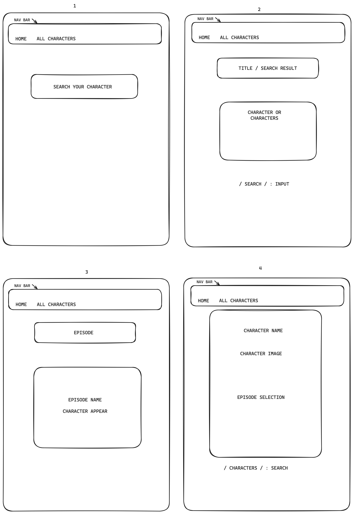

# SEI-P2
General Assembly Project 2 - API consuming app

[RickAndMorty]: https://nemomain.github.io/space-battleships/ 
[githubrepo]: https://github.com/Nemomain/SEI-P2


## Timeframe & team
This was a pair team effort by Gilberto Carnieli and Antonio Climent - 2 days

## Technologies used
* React
* React-Router-DOM
* Insomnia
* SASS
* Git
* Github


## [Space-Battle][space-battle] - JavaScript Application
## [Space-Battle Repository][githubrepo] - Application Repository

<!-- links where to find -->

## Project Description
This game was produced as part of the General Assembly Software Engineering Immersive Bootcamp, as the second project in the bootcamp using technologies taught in the bootcamp until this point, particularly React.

The project consists in taking data from the Rick and Morty API and displaying in web format the characters from the show, if a character is selected a list of the episodes that feature said character will be displayed as links. 

When an episode link is clicked a list of the characters featured in the episode will be displayed.


There is also a search bar on the homepage to search for any particular character.


## Project briefing
The brief we were handed specified the following:


```
#  Project #2: Reacathon
​
## Overview
​
The second project is to **build a React application** that consumes a **public API**.
​
### Technical Requirements
​
Your app must:
​
* **Consume a public API** – this could be anything but it must make sense for your project.
* **Have several components**
* **The app can have a router** - with several "pages", this is up to you and if it makes sense for your project.
* **Include wireframes** - that you designed before building the app.
* **Be deployed online** and accessible to the public (hosted on your public github, not GA github!)
​
---
​
## Necessary Deliverables
​
* A **working application**, hosted somewhere on the internet
* A **link to your hosted working app** in the URL section of your Github repo
* A **git repository hosted on Github**, with a link to your hosted project, and frequent commits dating back to the _very beginning_ of the project
* **A `readme.md` file** with:
 * Explanations of the **technologies** used
   * A couple of paragraphs about the **general approach you took**
   * **Installation instructions** for any dependencies
   * Link to your **wireframes** – sketches of major views / interfaces in your application
  * Descriptions of any **unsolved problems** or **major hurdles** your team had to overcome
​
---
​
## Suggested Ways to Get Started
​
* **Don’t hesitate to write throwaway code** to solve short term problems.
* **Read the docs for whatever technologies / frameworks / APIs you use**.
* **Write DRY code**.
* **Be consistent with your code style.**
* **Commit early, commit often.** Don’t be afraid to break something because you can always go back in time to a previous version.
* **Keep user stories small and well-defined**, and remember – user stories focus on what a user needs, not what development tasks need accomplishing.
* **Write code another developer wouldn't have to ask you about**. Do your naming conventions make sense? Would another developer be able to look at your app and understand what everything is?
* **Make it all well-formatted.** Are you indenting, consistently? Can we find the start and end of every div, curly brace, etc?
* **Comment your code.** Will someone understand what is going on in each block or function? Even if it's obvious, explaining the what & why means someone else can pick it up and get it.
* **Write pseudocode before you write actual code.** Thinking through the logic of something helps.
​
---
​
## Sign Off Reqs
​
* A working request in Insomnia from the API you want to use, showing that you can access the dataset you need.
* A basic wireframe of your apps design + components
​
## Useful Resources
​
* **[React](https://reactjs.org/)**
* **[Some free APIs](https://apilist.fun/)**
* **[Some more free APIs](https://github.com/public-apis/public-apis)**
* **[Even more free APIs](https://dev.to/camerenisonfire/10-intriguing-public-rest-apis-for-your-next-project-2gbd)**
* **[The best free API Finder](https://www.google.com)**
```

## Planning
We made a basic wireframe, displaying the different pages and routes we planned to use.

Gilberto made the wireframe, Antonio coded and debugged while Gilberto researched the methods and code pieces necessary.



## Build/Code Process
At first we started programming the All Characters tab, since it was the one which would give us a template to really get comfortable with the data structure returned from the API.

```javascript
import { Link, useLoaderData } from "react-router-dom"


export default function Chars(){
 /* Data is an array of 42 pages containing characters each */
 const chars = useLoaderData()
 return (
   <>
     <h1>Characters</h1>
     <div className="sections">
       {/* We map through the data */}
       {chars && chars.map(page => {
         const { results } = page
         // We map each character
         return results.map(char => {
           const {id, name, image} = char
           // And we render the component
           return (
             <Link key={id} to={`/characters/${id}`}>
               <section>
                 <h2>{name}</h2>
                 
               </section>
             </Link>
           )
         })
       })
       }
     </div>
   </>
 )
}

```
The function collecting the data
```javascript
export async function getAllChars() {
 try {
   const arr = []
   // fetch ALL characters from ALL pages and add them to the array
   for (let i = 1; i <= 42; i++){
     arr.push(getInfo(`?page=${i}`))
   }
   // chat Gpt helped here
   // Promise.all(arr) this waits for all promises inside to get resolved before returning as a single promise
   return Promise.all(arr)
 } catch (error) {
   console.log(error)
 }
}


async function getInfo(extra){
 try {
   // all your fetching needs in one place!
   const res = await fetch(`https://rickandmortyapi.com/api/character/${extra}`)
   return res.json()
 } catch (error) {
   console.log(error)
 }
}


```

When that was set up and running, we went on to program the route “/character/:charId” which displays a single character, clicked from the general list with a list of episodes which feature said character

```javascript
import { Link, useLoaderData } from "react-router-dom"


export default function SingleChar(){
 // We get a single character from the loader based on its id, then destructure it
 const char = useLoaderData()
 const {name, image, episode} = char


 return (
   <>
     <h1>Characters</h1>
     <div className="container">
       <div className="char">
         <h2>{name}</h2>
         
         <h3>Episode List</h3>
         <div className="eps">
           {/* Episode consists of an array of strings each referring to the episode */}
           {episode.map((ep, i) => {
             // The episode string is a url with the last section of it containing the episode's unique id
             // so we split it and the use num[num.length-1] to actually target the id
             const num = ep.split('/')
             return (
               <Link to={`/episode/${num[num.length-1]}`} key={i}>Episode {num[num.length-1]}</Link>
             )
           })}
         </div>
       </div>
     </div>
   </>
 )
}

```
The logic to get that single character (extremely simple, really)

```javascript
export async function getSingleChar(charId){
 return getInfo(charId)
}

```

When we had that piece of code running, it was turn for the “/episode/:epId” route to be coded

```javascript
import { Link, useLoaderData } from "react-router-dom"


export default function Episode(){
 // episode is an array with data from the episode on the first position and an array of the data from the characters in the episode on the other
 const ep = useLoaderData()
 // ep[0] is the episode data itself
 const {name, episode} = ep[0]
 return (
   <>
     <h1>{episode} {name}</h1>
       <h2 className="cast">Cast</h2>
       <div className="episodeCont">
         {/* ep[1] is the data of the characters IN the episode */}
       {ep[1].map(e => {
         // destructuring avoiding variable 'name' to be repeated
         const {id, name: charName, image} = e
         return (
           // rendering of the elements
           <section key={id}>
             <Link to={`/characters/${id}`}>
               <h3>{charName}</h3>
               
             </Link>
           </section>
           )
       })}
       </div>
   </>
 )
}

```

When we had all that finished, plus a component for the Navbar which repeats in every page, we introduced an input to the homepage in order to allow the user to look for any specific character they wish for

```javascript
import { useState } from "react"
import { useLoaderData, Link } from "react-router-dom"


export default function Home(){
 const [ search, setSearch] = useState('')
 const data = useLoaderData()
 // pattern gets updated each time the user writes on the
 const pattern = new RegExp(search, 'i')


 return (
   <>
   <h1>Search for Character</h1>
   <div className="formCont">
     <input type="text" name="charName" placeholder="Search Your Favourite Character" value={search} onChange={(e) => setSearch(e.target.value)}/>
   </div>
   <div className="sections">
     {/* Data is an array of 42 pages containing characters each so we map through it */}
   {data.map(p => {
     // we filter each page for the characters whose name match the search criteria and save them in a single array
     const chars = p.results.filter(r => pattern.test(r.name))
     // we map the array of matching characters to create each individual card
     return chars.map(c => {
       const {id, name, image} = c
       return (
         <Link key={id} to={`/characters/${id}`}>
           <section>
             <h2>{name}</h2>
             
           </section>
         </Link>
       )
     })
   })}
   </div>
   </>
 )
}

```

Finally, we gave it some styling which, to be honest, it’s a bit all over the place (the coding of it) because we prioritised the logical part of the page far more than the styling. The page looks fine, but the SASS files could be a bit neater and more organised.


## Challenges
The greatest challenge was getting used to React. As in getting it to work and not break. 

Of course this is our first time coding React in a project larger than a couple of documents, but we did find it very difficult to get used to and to debug when something broke. We definitely learnt a lot during all of this, but there is much more left to learn.

The data structure coming from the API, while not unworkable, was less than ideal. We couldn’t get all characters in a single request as the API had no endpoint for it; instead we had to do a request for each page of characters individually (42 in total). Handling the promises from so many requests was also an issue, and a teaching moment, as we learnt about Promise.all(arr)

## Wins/Key Learnings
Wins include, learning about promises, learning to destructure, and learning how to use routes with react-router-dom.

Each time React didn’t break was a win in itself! hahaha

## Bugs
The bug that stuck the most in my mind is obviously the error caused before I realised how to deal with the promises. Other than that, we encountered bugs when not configuring routes correctly, if we forgot to import some relevant file and things of that nature. All of them teaching moments, but none as unexpected and difficult to figure out as the first one I described.

## Future Improvements
What I think is a bit nonsensical right now is that the All characters page has become redundant after developing the homepage.

Had we more time we would take away the All characters page as substitute it with an episode list. We would have already done so if it wasn’t because the API doesn’t provide any images for the episodes, no synopsis, nothing other than the character list, name and episode number.

Even with its shortcomings, we have learnt about React with it so its true purpose has been realised. Hooray!